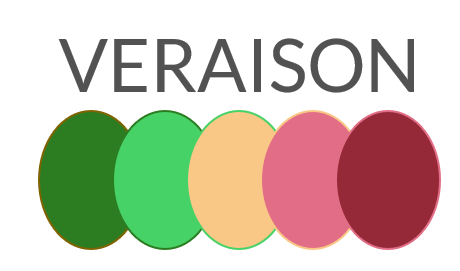
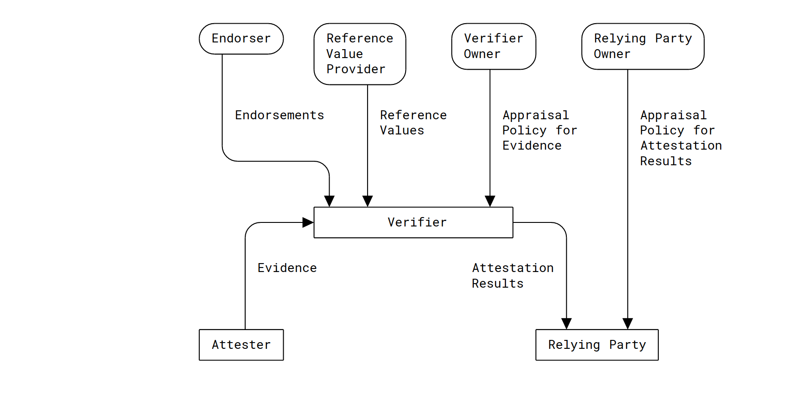
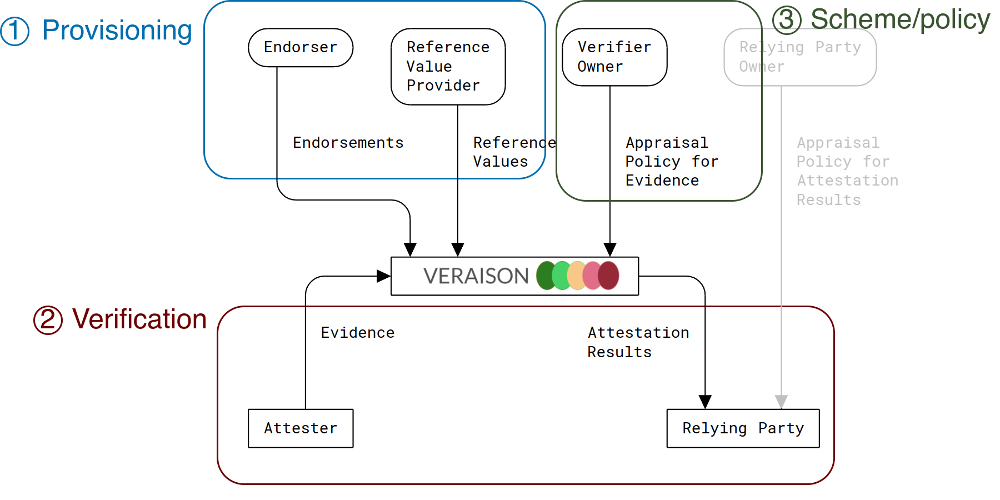

<!-- theme: gaia -->
<style>
img[alt~="center"] {
  display: block;
  margin: 0 auto;
}
img[alt~="inline"] {
  display: inline;
  margin: 0 auto;
  margin-right: 15px;
}
section.smallercode code {
  font-size: .6em;
}
section.evensmallercode code {
  font-size: 11pt;
}
section.smallerbullet li {
  font-size: 17pt;
}
</style>
<!-- _class: lead-->
<style scoped>section {font-size: 30pt}</style>

https://github.com/veraison

---
<!-- class: smallercode -->

## Agenda

- Introduction
- Veraison Remote Attestation Service Overview
    * Provisioning
    * Verification
    * Attestation schemes & policies
- Extending Veraison to match your remote attestation use case
- Libraries and tooling provided by the Veraison Project

---
<!-- _class: lead-->
# Introduction

---
<!--footer: Introduction-->

## Veraison is

- **VER**ific**A**t**I**on of atte**S**tati**ON**
- A collection of libraries and tools for implementing remote attestation
- A remote attestation verification service
    - RATS Architecture compliant
    - Flexible deployment model
- Open Source (Apache v2.0)
- A Confidential Compute Consortium project

<!--

Veraison project provides a set of libraries and tools for implemented remote
attestation. It also provides a remote attestation service implemented using
them.

RATS:
- Remote ATtestation procedureS
- An IETF (Internet Engineering Task Force) working group

Deployment:
    - may be distributed or single-node
    - plugin-based or with integrated schemes
    - at the moment only a docker-based deployment exists

This presentation is mostly about the service; the tools and libraries will be
mentioned near the end.

-->

---

## Attestation

- A means to establishing the trustworthiness of a TEE
- Produces signed evidence about an entity
- Attestation report alone is insufficient
    - Must be verified via a trusted service

<!--
TEE: Trusted Execution Environment

“Confidential Computing protects data in use by performing computation in a hardware-based Trusted Execution Environment”
Confidential Computing: Hardware-Based Trusted Execution for Applications and Data

- CC service users *must* be able to establish that a TEE is trustworthy
    - Hardware & Software aspects of the TCB are "correct"
- The means to establish trustworthiness is Attestation
   - Attestation produces evidence about an entity, signed by a Trust Anchor
- Being able to produce an Attestation report alone is not sufficient
   - The report must be Verified to prove the constituent claims
- Verification may be non-trivial, relying on additional endorsements, and so
  it makes sense to outsource it to a trusted dedicated service.
-->

---

## RATS Architecture



https://www.ietf.org/rfc/rfc9334.html

<!--

- Rounded cornered boxes indicate human/organisational entities
- Rectangular boxes indicate processes/applications

##  Roles

Attester: A role performed by an entity (typically a device) whose Evidence
must be appraised in order to infer the extent to which the Attester is
considered trustworthy, such as when deciding whether it is authorized to
perform some operation.

Relying Party: A role performed by an entity that depends on the validity of
information about an Attester for purposes of reliably applying
application-specific actions.

Verifier: A role performed by an entity that appraises the validity of Evidence
about an Attester and produces Attestation Results to be used by a Relying
Party.

Relying Party Owner: A role performed by an entity (typically an administrator)
that is authorized to configure an Appraisal Policy for Attestation Results in
a Relying Party.

Verifier Owner: A role performed by an entity (typically an administrator) that
is authorized to configure an Appraisal Policy for Evidence in a Verifier.

Endorser: A role performed by an entity (typically a manufacturer) whose
Endorsements may help Verifiers appraise the authenticity of Evidence and infer
further capabilities of the Attester.

Reference Value Provider: A role performed by an entity (typically a
manufacturer) whose Reference Values help Verifiers appraise Evidence to
determine if acceptable known Claims have been recorded by the Attester.

##  Artifacts

Claim: A piece of asserted information, often in the form of a name/value pair.
Claims make up the usual structure of Evidence and other RATS conceptual
messages.

Endorsement: A secure statement that an Endorser vouches for the integrity of
an Attester's various capabilities, such as Claims collection and Evidence
signing.

Evidence: A set of Claims generated by an Attester to be appraised by a
Verifier. Evidence may include configuration data, measurements, telemetry, or
inferences.

Attestation Result: The output generated by a Verifier, typically including
information about an Attester, where the Verifier vouches for the validity of
the results.

Appraisal Policy for Evidence: A set of rules that a Verifier uses to evaluate
the validity of information about an Attester.

Appraisal Policy for Attestation Results: A set of rules that direct how a
Relying Party uses the Attestation Results regarding an Attester generated by
the Verifiers.

Reference Values: A set of values against which values of Claims can be
compared as part of applying an Appraisal Policy for Evidence. Reference Values
are sometimes referred to in other documents as "known-good values", "golden
measurements", or "nominal values". These terms typically assume comparison for
equality, whereas here, Reference Values might be more general and be used in
any sort of comparison.

-->

---

## RATS Architecture



https://www.ietf.org/rfc/rfc9334.html

<!--

- Veraison service implements a RATS verifier.
- Endorsements and  Reference Values (and Trust Anchors) are supplied via the
  provisioning REST interface.
- Attestation of evidence is performed via the verification REST interface.
- Veraison implements separate endpoints for provisioning and verification.

-->
---
<!-- _footer: ""-->
<!-- _class: lead-->
# Veraison Overview

---
<!--footer: Veraison Overview-->
## Veraison Architecture


<!--
-->
---

<!--footer: Veraison Overview / Provisioning-->
## Provisioning

- Supply **endorsements** and **trust anchors** to the Veraison service
- Data is packaged inside **CoRIM** tokens
- <span style="font-size:19pt">https://github.com/veraison/docs/blob/main/api/endorsement-provisioning/README.md</span>

<!--
- Discrepancy between Veraison and RATS:
    - Veraison defines "trust anchor" as a distinct concept.
    - Veraison does not distinguish between "reference values" and other kinds of
      "endorsements".
    - The reason for the Verasion separation is that we expect most supply
      chains to provision "endorsements" common to a particular device type
      (e.g. model/version), while trust anchors may be unique to particular
      instances of these.
- CoRIM: Concise Reference Integrity Manifest
    - Based on COSE/CBOR
    - The format is scheme-agnostic (though contents are scheme specific).
- Provisioning can be done in parts to support complex supply chains.
-->
---

## Provisioning


<!--
This is a simplified view, omitting a lot of headers and response fields that
are not relevant to the logical flow.

- Client submits the endorsement provisioning request
- Server responds with response code 200 indicating processing is complete. The
  response body contains a session resource with a status indicating the
  outcome of the submission operation.
- REST API also support asynchronous provisioning (currently not implemented by
  the service), where instead of 200 OK, you get a 201 Created, and then poll
  for completion.
-->
---

## Provisioning Pipeline


<!--
-->
---

## Provisioning Pipeline


<!--
-->
---

## CoRIM

- **Co**ncise **R**eference **I**ntegrity **M**anifest
- A signed, **CBOR**-formatted document (**COSE**)
- Data are represented as subject-verb-object "triples", e.g.
  ```
  component "X" -  has reference values - [list of values]
  ```
- Also contains metadata (provisioner identity, versioning, etc.)
- https://github.com/veraison/corim

<!--
CBOR (RFC8949): https://www.rfc-editor.org/rfc/rfc8949.html
COSE (RFC8152): https://www.rfc-editor.org/rfc/rfc8152.html
-->
---
## CoRIM Template Excerpt
```json
  "entities": [{
      "name": "ACME Corp.",
      "regid": "https://acme.com",
      "roles": [ "tagCreator", "creator", "maintainer"]
  }],
  "triples": {
    "reference-values": [
      {
        "environment": { "instance": { "type": "uuid", "value": "7d<...>f1" }},
        "measurements": [
          { "value": { "digests": [ "sha-256:h0KPxS<...>MTPJcc=" ] } }
        ]
     }
 }
```

<!--
CBOR (RFC8949): https://www.rfc-editor.org/rfc/rfc8949.html
COSE (RFC8152): https://www.rfc-editor.org/rfc/rfc8152.html
-->
---

<!--footer: Veraison Overview / Verification-->

## Verification

- A session is established with an agreed upon **nonce**
- Attester/Relying Party submits **evidence** to the verification service
- Gets back a signed **attestation result** as an **EAR** document
- <span style="font-size:19pt">https://github.com/veraison/docs/blob/main/api/challenge-response/README.md</span>

<!--
- Whether verification is performed  by the attester or the relying party
  depends on which RATs Architecture Topological Model is used in the scheme:
    - Passport: done by the attester
    - Background-check: done by the relying party
- Evidence is scheme-specific and is specified via `Content-Type` header in the
  submission request.
- EAR: EAT Attestation Result
    - EAT: Entity Attestation Token
-->
---

## Verification


<!--
This is a simplified view, omitting a lot of headers and response fields that
are not relevant to the logical flow.

- Client submits the endorsement provisioning request
- Server responds with response code 200 indicating processing is complete. The
  response body contains a session resource with a status indicating the
  outcome of the submission operation.
- REST API also support asynchronous verification (currently not implemented by
  the service), where instead of 200 OK, you get a 201 Created, and then poll
  for completion.
-->
---

## Verification Pipeline


<!--
-->
---

## Verification Pipeline


<!--
-->
---

## EAR

- **E**AT **A**ttestation **R**esults
- A signed JSON document (**JWT**) containing
  - An overall status and an **AR4SI** trust vector
  - Annotated evidence*
  - Policy claims*
- https://datatracker.ietf.org/doc/draft-fv-rats-ear/
- https://datatracker.ietf.org/doc/draft-ietf-rats-ar4si/

<span style="font-size:20pt">
*Veraison extension
</span>

<!--
- Optionally, can also be packaged as CBOR/COSE
- JWT: JSON Web Token
- AR4SI: Attestation Results for Secure Interactions
-->
---

## EAR Example
```json
{
    "ear.status": "affirming",
    "ear.trustworthiness-vector": {
        "configuration": 0,
        "executables": 2,
        [ ... ]
    },
    "ear.veraison.annotated-evidence": {
            "firmware-version": 7,
            "pcr-selection": [1, 2, 3, 4],
            "pcr-digest": "h0KPxSKAPTEGXnvOPPA/5HUJZjHl4Hu9eg/eYMTPJcc=",
            [ ... ]
    }
}

```

---

<!--footer: Veraison Overview / Scheme & Policy-->

## Attestation Scheme

- Defines
  - Evidence token structure
  - What endorsements and trust anchors are expected
  - How the evidence is appraised
- Implemented via pluggable interfaces
- May be augmented via deployment-specific policies

<!--
- Depending on build configuration, schemes may be built as externally-loaded
  plugins, or may be integrated into Veraison service executables.
-->
---

## Policies

- Allow "post-processing" results generated by the scheme
  - Override appraisal decisions
  - Insert additional claims
- Implemented using **OPA** Engine
- Written in **Rego** language
- https://www.openpolicyagent.org/docs/latest/policy-language/

<!--
OPA: Open Policy Agent

- Veraison
  - Defines rules that may be implemented to override the corresponding entry
    in the AR4SI trust vector.
 -  Provides evidence and endorsement structures as inputs
 - Provides utility functions to help implement policies
-->
---

## Policy Example
```bash
# This sets executables trust vector value to AFFIRMING iff BL version is
# 3.5 or greater, and to failure otherwise.
executables = "AFFIRMING" {
  # there exisists some i such that...
  some i
  # ...the i'th software component has type "BL", and...
  evidence["psa-software-components"][i]["measurement-type"] == "BL"

  # ...the version of this component is greater or equal to 3.5.
  # (semver_cmp is defined by the policy package. It returns 1 if the first
  # parameter is greater than the second, -1 if it is less than the second,
  # and 0 if they are equal.)
  semver_cmp(evidence["psa-software-components"][i].version, "3.5") >= 0
} else = "CONTRAINDICATED" # unless the above condition is met, return "CONTRAINDICATED"
```

<!--
This is an example for PSA evidence

`semver_cmp` is a utility function provided by Veraison
-->
---
<!-- _class: lead-->
<!--footer: "" -->
# Extending Veraison

---
## Options
<!--footer: Extending Veraison -->

- Write an OPA Policy
    - Simpler -- a single Rego file
    - Leverages existing functionality (e.g. token validation)
    - Limited to working within the confines on an existing scheme
    - <span style="font-size:22pt">https://github.com/veraison/services/blob/main/policy/README.opa.md</span>
- Implement Attestation Scheme
    - More flexible, but
    - More involved

<!--
Writing OPA Policy: See linked REAME and the Rego language documentation
    - https://www.openpolicyagent.org/docs/latest/policy-language/

The remainder of the section will be discussing implementing a new Scheme
    - Requires writing non-trivial amounts of Go code
        - can use existing plugins as examples
    - Con implement pretty much any attestation scheme that fits within RATS
      models.
-->
---
## Implementing an Attestation Scheme

Write a Go executable that

- Implements `IEndorsementHandler` and `IEvidenceHandler` interfaces, and
- Serves them as plugins

---
## Implementing an Attestation Scheme
<!-- _class: evensmallercode -->

```go
package main

import (
	"github.com/veraison/services/handler"
	"github.com/veraison/services/plugin"
)

type MyEndrosementHandler struct {}

// Implementation of IEndrosementHandler for MyEndrosementHandler
// ...

type MyEvidenceHandler struct {}

// Implementation of IEvidenceHandler for MyEvidenceHandler
// ...

func main() {
	handler.RegisterEndorsementHandler(&MyEndorsementHandler{})
	handler.RegisterEvidenceHandler(&MyEvidenceHandler{})

	plugin.Serve()
}
```

---

## Endorsements Handler
```go
type EndorsementHandlerParams map[string]interface{}

type IEndorsementHandler interface {
	GetName() string
	GetAttestationScheme() string
	GetSupportedMediaTypes() []string

	Init(params EndorsementHandlerParams) error
	Close() error
	Decode([]byte) (*EndorsementHandlerResponse, error)
}
```

<!--
GetName -- Returns the name of this IEndorsementHandler implementation

GetAttestationScheme -- Returns the name of the AttestationScheme this
implements.
    - important that IEndorsementHandler and IEvidenceHandler agree on this

GetSupportedMediaTypes -- a  list of media types (as specified in
`Content-Type` request header) that is  handled by this implementation

Init/Close -- self explanatory

Decode -- The "meat" of this implementation, this extracts endorsements and
          trust anchors  from the CoRIM
-->

---

## Endorsements & Trust Anchors

```go
type EndorsementHandlerResponse struct {
	ReferenceValues []Endorsement
	TrustAnchors    []Endorsement
}

type Endorsement struct {
	Scheme string
	Type   int32
	SubType    string
	Attributes map[string]interface{}
}

```

<!--
Note: these structure have been altered from their actual definitions in code
for simplicity.

Endorsement field:

Scheme -- the name of the scheme the endorsement is associated with
Type -- an enum indicating whether this is a "RefVal" or a "TA" (it's int32
        because that's how enums are represented in protobuf)
SubType -- a scheme-specific indication of what the value represents
Attributes -- the actual value of the endorsement.

-->

---

## Evidence Handler
```go
type IEvidenceHandler interface {
	GetName() string
	GetAttestationScheme() string
	GetSupportedMediaTypes() []string

	SynthKeysFromRefValue(tenantID string, refVal *Endorsement) ([]string, error)
	SynthKeysFromTrustAnchor(tenantID string, ta *Endorsement) ([]string, error)

	GetTrustAnchorID(token *AttestationToken) (string, error)
	ExtractClaims(token *AttestationToken, trustAnchor string) (*ExtractedClaims, error)
	ValidateEvidenceIntegrity(
		token *AttestationToken,
		trustAnchor string,
		endorsementsStrings []string,
	) error
	AppraiseEvidence(ec *EvidenceContext, endorsements []string) (*ear.AttestationResult, error)
}
```
<!--
The first three Get* methods -- same as above

SynthKeysFromRefValue / SynthKeysFromTrustAnchor -- these are used to sythesize
lookup keys with K-V store for the refvals and TAs.

GetTrustAnchorID -- extract TrustAnchor ID from the token this is used to
fetch the TA, so that the token can be validated before claims are extracted.

ExtractClaims --  Extract claims form the token into a map[string]interface{}
                this also generates the referenceid

ValidateEvidenceIntegrity - check signature, make sure mandatory fields are
                present and valid, etc

AppraiseEvidence - Produce the final appraisal by evaluating the extracted
                claims against endorsements. This performs logical mapping from
                claims/endorsements onto AR4SI
-->

---

## Attestation Token & Claims

```go
type AttestationToken struct {
	TenantId  string
	Data      []byte
	MediaType string
	Nonce     []byte
}

type ExtractedClaims struct {
	ClaimsSet   map[string]interface{}
	ReferenceID string
}
```
<!--
Note: these structure have been altered from their actual definitions in code
for simplicity.

AttestationToken:

TenantId --  The tenant id (multi-tenancy currently isn't implemented in Veraison,
but this field will be used when  it finally is; currently it's just 1). This
should be used in SynthKeys* methods.

Data -- the bytes of the token (sent in the HTTP request body)

MediaType -- media type of the token (extracted form the Content-Type header)

Nonce -- established during session creation; used to prevent replay attacks.

ExtractedClaims:

ClaimSet -- actual claims extracted from the token
ReferenceID -- used to get RefVals associated with theses claims

-->

---

<!-- _class: lead-->
<!--footer: "" -->
# Libraries & Tooling

---

## Tooling
<!--footer: Libraries & Tooling -->
<!--_class: smallerbullet -->

- `cocli`
    - Create CoRIMs from JSON "templates" and send them to Veraison provisioning
      service.
    - https://github.com/veraison/corim/tree/main/cocli
- `evcli`
    - Manipulate attestation evidence
    - Currently only supports CCA and PSA
    - https://github.com/veraison/evcli
- `polcli`
    - Manage OPA policies
    - https://github.com/veraison/services/tree/main/policy/cmd/polcli
- `arc`
    - Create and verify signed EARs
    - https://github.com/veraison/ear/tree/main/arc

<!--
-->
---

## Libraries
<!--_class: smallerbullet -->
- https://github.com/veraison/apiclient
    - Veraison REST API client (Go)
- https://github.com/veraison/rust-apiclient (Rust)
    - Veraison REST API client (Rust)
- https://github.com/veraison/corim
    - Concise Reference Integrity Manifest and Module Identifiers
- https://github.com/veraison/ear
    - Attestation Results for Secure Interactions (Go)
- https://github.com/veraison/c-ear
    - Attestation Results for Secure Interactions (C)
- ...and several others under https://github.com/veraison
<!--
Unless otherwise indicated, theses are Go libraries
-->
---
<!-- _footer: "" -->
<!-- _class: lead -->
# Thank You

